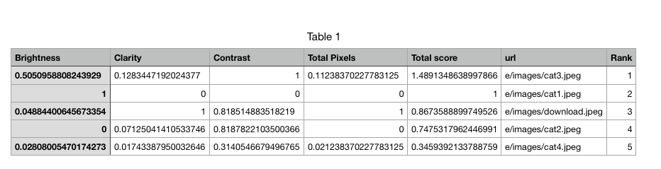

# image-quality-analysis
Python code to select the best image comparing various features namely brightness, contrast, pixels,clarity. The application uses openCV, pandas, numpy, PIL to make a feature matrix for a directory of images.

The result matrix received in the result directory is like this -

